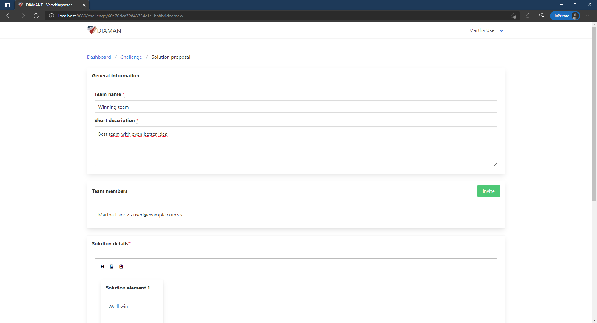

# Diamant Idea Management System

This project was developed as part of the research project DIAMANT and is based on the following paper:

Ruiner C., Hagemann V., Hesenius M., Klumpp M. (2020) _Digitales Ideenmanagement als Mitbestimmung 4.0? Chancen und Herausforderungen der Partizipation von Mitarbeitenden in betrieblichen Veränderungsprozessen_. In: Bader V., Kaiser S. (eds) Arbeit in der Data Society. Zukunftsfähige Unternehmensführung in Forschung und Praxis. Springer Gabler, Wiesbaden. [https://doi.org/10.1007/978-3-658-32276-2_15](https://doi.org/10.1007/978-3-658-32276-2_15)

Core idea of the project is that companies can ask their employees for possible solutions for a certain problem (so called 'challenge' in our tool)

Employees can - possibly as a team - submit their solution proposal ("idea"):

Later on the Reviewer can nominate certain ideas for public voting and all registered members can vote for their favourite idea.

## Special features
- Working in teams for developing ideas
- Feedback options both while idea development and general livecycle of the challenge
- A lot more...

## Getting started:
For sake of simplicity, the project can be started with `docker-compose up`.

### Configuration
Before starting, please note, that the idea management needs a valid mail server for sending confirmation and password-reset mails.
If the docker-compose file is used, the mail server has to be changed in file `./data/keycloak/keycloak_diamant_realm.json` in line 1206 to 1215.

Furthermore, note that an `.env`-file exist configuring some initial parameters (like passwords). These should be changed!

### First start
After that, the platform can be started with `docker-compose up -d`. The docker-compose file starts all needed modules 
(Postgres, MongoDB, Keycloak, Backend, Frontend) and initializes them as needed (e.g. creates a suitable keycloak realm, etc).

**Keycloak takes some time to start up. Please be patient**

After everything started successfully, the following endpoints are reachable:
- Frontend: `http://localhost:8080`
- Keycloak admin page: `http://localhost:9090/auth`

### Existing user:
The following users have been created during start up:

| username   |      password      |  comment |
|----------|-------------|------|
| caller@exmaple.com |  caller | has caller rights, i.e. is able to create new challenges |
| user@example.com |    user   |    |
| admin | keycloakAdmin |    keycloak admin|

### Creating challenges
Please note, that only users with the (keycloak) role `caller` are able to create new challenges.
To grant a certain user this right, follow these steps:
1. Open the keycloak admin interface and login with the admin account.
2. If needed, select the diamant realm at the top left (should be already selected)
3. Go to `Manage` > `Users` > `View alle users`
4. Find the user, you want to grant caller rights and click on `edit`
5. Open the tab `Role Mappings` 
6. Select `caller`-role in the table `Available Roles` and click on `Add selected`

Currently, this has to be done manually for every user that needs caller permissions.
